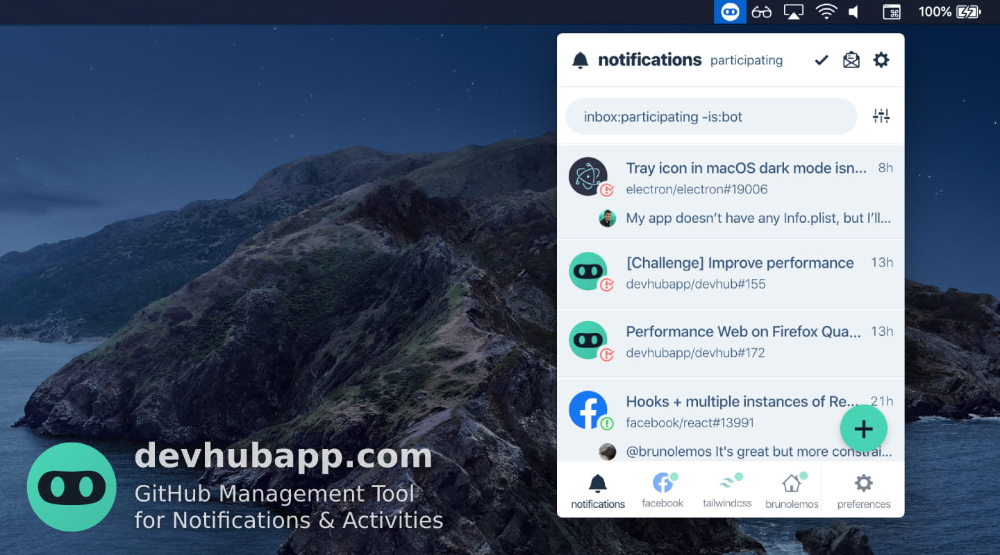
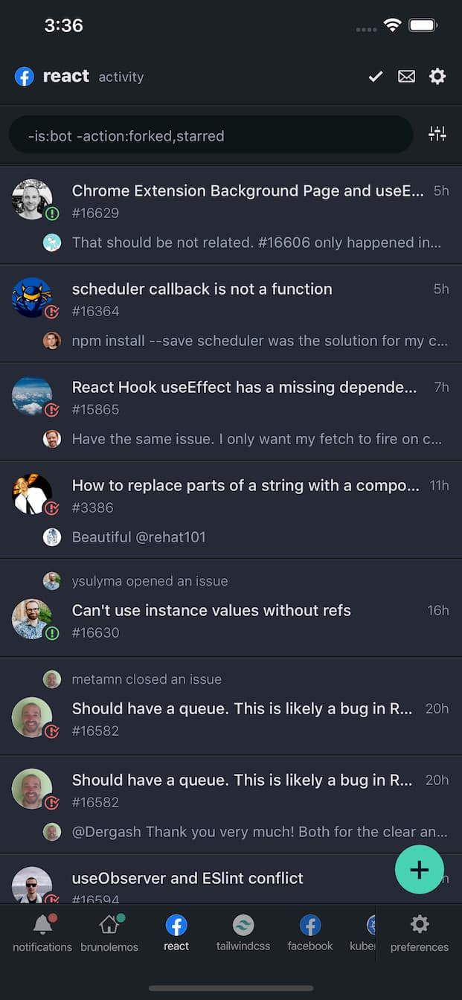

## Screenshots

### Desktop

)

#### Menubar

### Mobile

  
  
  

 

## Features

- [x] **Multi-column layout**: See at a quick glance everything that is going on (like TweetDeck!);
- [x] **Filters**: Apply different filters to each column, save your custom searches to make your life easier;
- [x] **Inbox Zero**: Mark columns as done and gain peace of mind;
- [x] **Notifications manager**: See all the relevant information before opening the notification, like comment content, issue/pull request status, release description, etc.;
- [x] **Repository watcher**: Keep up to date with repositories' activities without using the `watch` feature so your notifications don't get cluttered;
- [x] **User stalking**: Follow user activities without using the `follow` button; see activities that GitHub doesn't show on your feed, like their issue comments and pushed commits;
- [x] **Home/Dashboard**: See yours or other users' home screen (a.k.a. GitHub Dashboard), a great way to discover interesting repositories;
- [x] **Save for later**: Save any activity or notification for later, so you don't forget to get back to them;
- [x] **Keyboard shortcuts**: Do anything using only the keyboard (press Shift+? in the web or desktop app to see all available shortcuts);
- [x] **Theme support**: Choose between 6 light or dark themes; Automatically detect system preference;
- [x] **And more!**: Desktop apps, native mobile apps, open source, modern tech stack, ...

 
